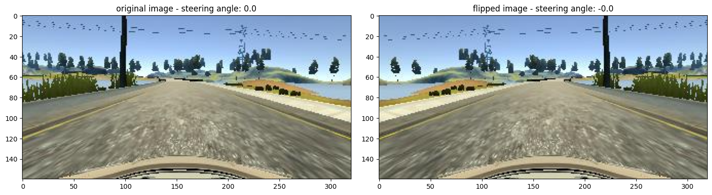
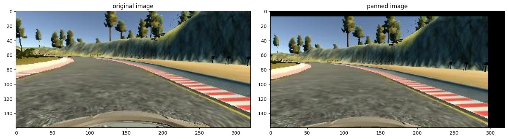
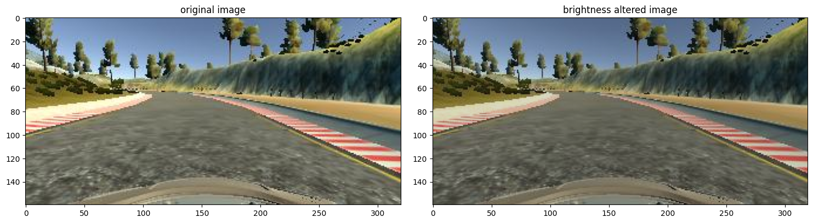
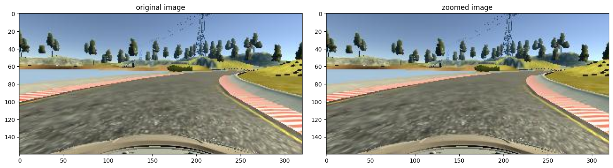
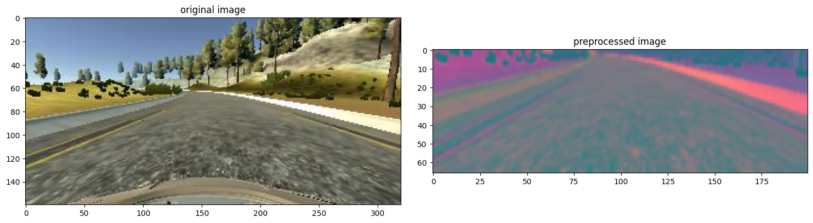
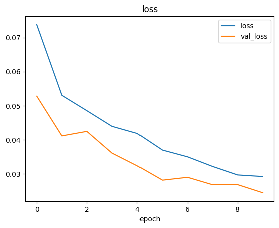

# virtual-self-driving-car

this is an applied deep learning project where a convolutional neural network (cnn) was developed to predict the steering angle of a car in real time. computer vision techniques such as data augmentation, image preprocessing, and batch generation were employed to improve the model's performance and robustness.  

the model is based on the **nvidia architecture**, consisting of five convolutional layers followed by fully connected layers.

---

## data augmentation techniques

to increase data variability and simulate different driving scenarios, the following augmentation methods were applied:

### 1. image flipping   


### 2. image panning   


### 3. altering brightness  


### 4. image zooming   


---

## image preprocessing

the input images were preprocessed by cropping irrelevant parts (e.g., sky and car hood), resizing, and normalizing pixel values.



---

## training results

the model was trained using a custom batch generator to efficiently feed augmented data into the network. a clear distinction between training and validation loss indicates effective learning and minimal overfitting.



---

## technologies used:

- python
- keras / tensorflow
- opencv
- numpy
- matplotlib
- google colab

---

the training data was made from udacity's [self-driving-car-sim](https://github.com/udacity/self-driving-car-sim.git) application. it was then tested in autonomous mode on two different terrains. in this repo there are two data folders. while the first one is a bit biased to the left, the second one is unbiased (mostly). i myself have used [ryan slim](https://www.udemy.com/user/rayan-slim/?srsltid=AfmBOopriGroXdgGx4ImwTj76Uzn7D2e1hcXKrtyBZDLs9kSn025rAjr)'s data. feel free to use my data or generate your own in the training mode and use it to build a new model.


---

## setup instructions:

### 1. clone the repo
```
git clone https://github.com/rthponder/virtual-self-driving-car.git
cd virtual-self-driving-car
```

### 2. create and activate a virtual environment
```
conda create --name ml_app python=3.x
conda activate ml_app
```

### 3. install dependencies
```
pip install -r requirements.txt
```

### 4. build your own model (optional but recommended)
create your own data from udacity's [self-driving-car-sim](https://github.com/udacity/self-driving-car-sim.git) application or download the dataset from [kaggle.com](https://www.kaggle.com/datasets/sshikamaru/udacity-self-driving-car-dataset). you can then generate the model by running all the cells in [behavioural_cloning](behaviourial_cloning.ipynb) on google colab. just make sure you edit the first few lines to change the dataset.

### 5. test your model
to test your generated model, run this in your terminal and test it in autonomous mode on udacity's application:
```
python drive.py
```

---

## demo:

the generated model was then tested on autonomous mode in the second terrain. you can watch the demo [here](https://iitkgpacin-my.sharepoint.com/:v:/g/personal/karthikeya1205_kgpian_iitkgp_ac_in/Eb5CF3fiX0JHo8KQN6Bh8YABGdgT_dOIaiGEd63srAK8gQ?e=by7A46)

---

###### this project was made from [ryan slim](https://www.udemy.com/user/rayan-slim/?srsltid=AfmBOopriGroXdgGx4ImwTj76Uzn7D2e1hcXKrtyBZDLs9kSn025rAjr)'s course on udemy.com. he is a great teacher and i'm grateful to him.
